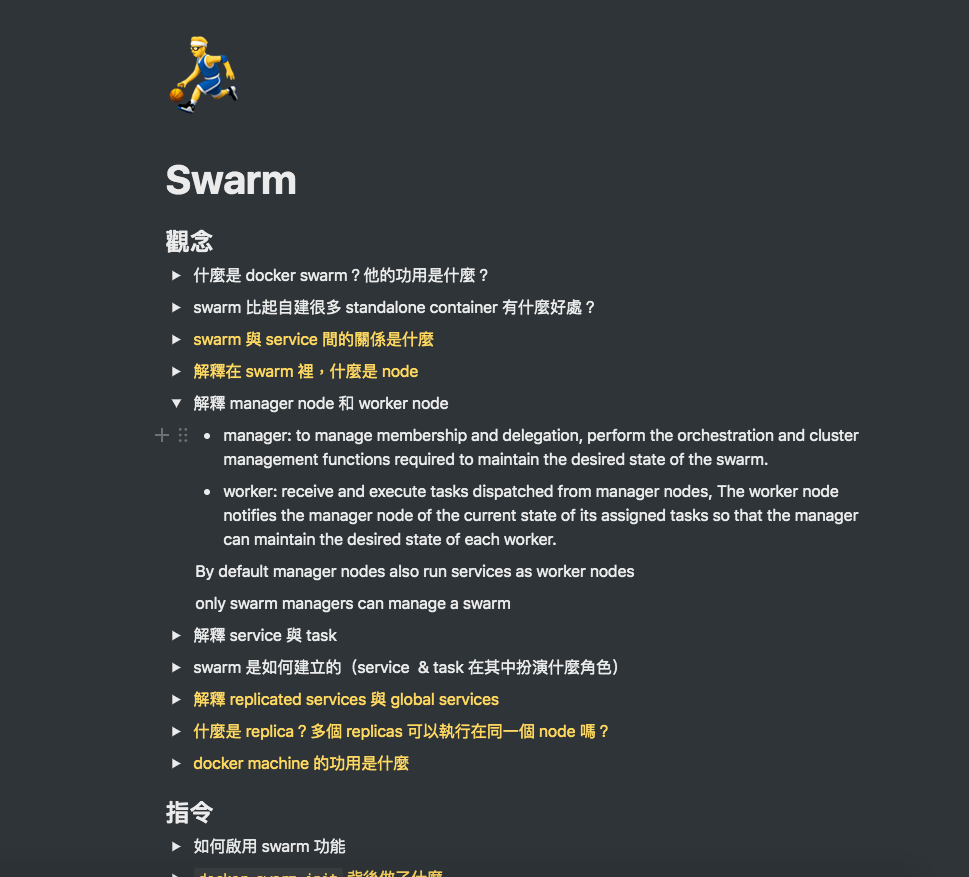

我使用 Notion 到現在已經差不多半年了，慢慢也累積了一些心得想分享給大家，如果你還不知道什麼是 Notion，簡單來說它是一個功能強大的筆記軟體，你甚至可以用它來管理你的整個生活，在這篇文章裡我會先談談我的使用感想，接著分享我平時是如何使用它的。

## Notion 使用心得

Notion 是我現在最愛的 app 之一，我歸納出了我如此愛它的幾點原因：

### 漂亮的介面

Notion 中每個 Page 的 Emoji 和 cover 都可以個人化，你能夠自由設計出符合你風格的筆記天地，雖然只有 Emoji 和 cover 乍聽之下有點少，但正是因為這種「適量的個人化」，讓你在擁有自己風格 Page 的同時 ，也不會因過於花俏的樣式而在做筆記時分了心。

除此之外，Notion 的漂亮介面也讓我變得愈來愈愛學習。我的習慣是讀完一個章節的新東西，才會開一個新 Page 來記錄內容，為了使我的 Notion 能看起來更豐富、有更多 Emoji，我開始會自主地想要學習，學習對我而言有了另一個誘因 — 裝飾我的 Notion。

下圖是我讀 Docker 做的筆記，是不是會一直想加新的 Emoji 上去呢 😆

### 觸發創意的 Block

Notion 中的 Block 代表一個基礎的寫作單位，它可以是標題，可以是 To-do List，也可以是純文字，Block 有多樣化的種類。

這些多樣化的種類讓你能輕易的拼湊出你心目中的模板，並在你所愛的模板上做筆記。[Notion Template](https://www.notion.so/Notion-Template-Gallery-181e961aeb5c4ee6915307c0dfd5156d) 也有很多現成的模板，可以參考看看。

### 分享功能

這裡的分享功能指的是將你的某一個 Page 以網頁的形式發佈出去，讓其他人可以透過網址看到你所分享的 Page。

雖然現在許多筆記軟體都有這個功能，但或許是因為 Notion 整潔漂亮的介面還有多元的 Block，所以會讓你分享的頁面看起來就像一個經過精心設計的網頁一樣，同時也因為多元的 Block，讓你可以清楚地表達你想傳達的意思，可以這樣說，Notion 的其他特色讓「分享」這個功能變得更棒。

## 我如何使用 Notion

### 學習筆記

上圖是我其中一篇學習筆記，在做這份筆記時，我會將重點包裝成「一個個的問題」，然後利用 toggle list 將答案放在展開後的內容裡，像上圖筆記中的第五點那樣，這種做法其實就很像我們以前會做的單字卡，你必須看題目先想想答案會是什麼，如果真的記不起來或不確定，才能去看答案，這個看似不起眼的過程會大大的增進你學習的成效，這種學習法稱為「Active Recall」，它是一個經過[實證非常有效的學習方式](https://www.amazon.com/Make-Stick-Science-Successful-Learning/dp/0674729013)，關於更詳細的說明與方法，可以參考 [Ali Abdaal 的這個影片](https://www.youtube.com/watch?v=ukLnPbIffxE&t=9s)，這個筆記方式也是向 Ali Abdaal 學的，他用 Notion 的方法真的很有創意，蠻推薦去看看他關於 Notion 的影片。

### 靈光一閃

在這一頁中，我會記下所有我搭公車時、上課時、或看書時突然想到的 idea，這些 idea 多半會成為我之後的創造材料。

將 idea 記錄下來的習慣是很重要的，如同[Building a Second Brain](https://praxis.fortelabs.co/basboverview/) 這篇文章所說：

> Our brain is for having ideas, not storing them.

有了這個習慣之後，你會發現隨著你記錄下來的點子愈多，你想到點子的頻率也會愈來愈高，這是一件我覺得很神奇的事，你可以體會看看 😜

### 共鳴筆記

共鳴筆記的想法同樣來源於 [Ali Abdaal](https://www.youtube.com/watch?v=lKYBB-Uw1IM)，這個 Page 會紀錄下所有你看完、聽完覺得非常有共鳴的東西，「共鳴筆記」和「靈光一閃」不同的地方是，「共鳴筆記」內的東西是儲存起來，留作之後查閱參考的，而「靈光一閃」內的東西則是你想要有所行動的 idea。舉個例子：我會將某個 TED 演講內容放在「共鳴筆記」，然後將「分享 TED 演講在 Blog 上」這個 idea 放在「靈光一閃」。

當初我被共鳴筆記這個概念吸引的原因是，它能讓你簡單地做出回顧，譬如說「2019 看過最棒的 5 篇文章」或是「每月最愛精選」，這些內容都是部落格或影片很棒的題材，如果你平時有在做共鳴筆記，那你就只要往前翻找，選幾篇最棒的內容來分享就好了，不用擔心找不到或忘記。

---

一樣好的工具，是會讓你一直想要用它，而 Notion 正是這樣的一個產品。

我現在的生活幾乎都記錄在 Notion 上，我十分享受這種生活井然有序的感覺，未來如果我有更多關於 Notion 的想法會再更新給大家。
