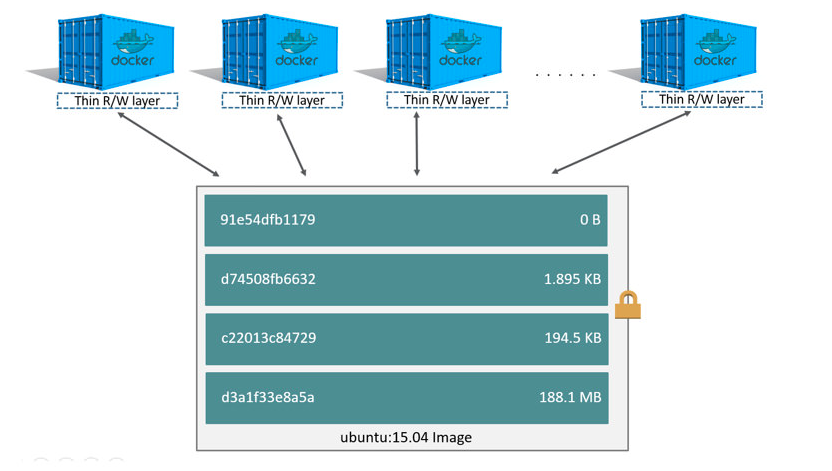
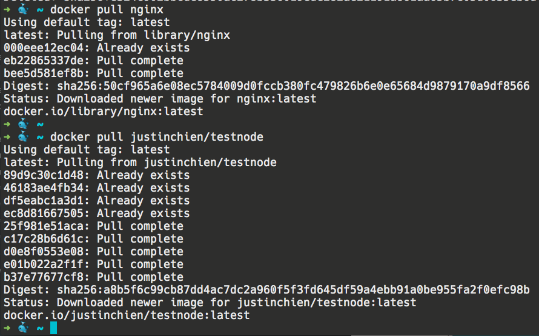

在這個章節，除了會教你如何透過 Dockerfile build image 外，也會教你更多關於 image 的知識，那我們就開始吧！

## image layer

image 可以被分解為數層 layer，每層 layer 都對應到 Dockerfile 的其中一行指令，layer 有各自不同的大小及 ID，下面是一個 Dockerfile 與他的 layer 示意圖

```
FROM ubuntu:15.04
COPY . /app
RUN make /app
CMD python /app/app.py
```



從圖中你可以看到幾件事

- container 可以視為一個 layer 加在原先的 image 之上
- image layer 是 read-only 的，但 container layer 是可讀寫的

看到這你可能會想問 layer 的用途到底是什麼？為什麼我們需要 layer？

答案是：layer 的設計提高了 image 部份內容的可重用性。這是什麼意思呢？假設你今天 pull 一個以這個 Dockerfile build 出來的 image

```
FROM ubuntu:16.04
COPY . /app
# 以下省略
```

同時也 pull 以另一個 Dockerfile build 出來的 image

```
FROM ubuntu:16.04
# 以下省略
```

在 pull image 時 docker 會一個 layer 一個 layer 的下載，此時

- 如果它遇到擁有新 ID 的 layer，也就是它以前沒看過的指令的話，他會將這組 layer 下載並存起來
- 如果它遇到它曾經下載過的 layer，它會直接跳過，不會再下載一次

所以回到上面的例子，這兩個 image 的內容都有 `FROM ubuntu:16.04`，由這句指令創造出的 layer 會有相同的 ID，因此 docker 在 pull 第二個 image 時其實不會再下載一次 `FROM ubuntu:16.0`這個 layer。之後當以第二個 image 為基底的 container 要建立時，會與以第一個 image 為基底的 container 共用同一層 layer

這代表，針對同一種 layer，docker 只會在你的電腦存一次，減少 image 的下載時間以及存儲空間



這個 testnode 是由 nginx 這個 image 再加一些東西 build 出來的，所以你會發現很多 layer 都顯示「Already exists」，代表這些 layer 你都不用下載了 😄

## CoW

image 設計成 read-only 是對你好的，因為你不會希望以同一個 image run 出的 container 行為不一樣，如果你想新增或修改一些東西，可以加在 container layer 裡

所謂的 CoW（copy-on-write） 是一個當你在 container 對某個檔案做修改時將使用的策略，主要會依序進行以下幾件事：

1. 從上層 layer 往下層尋找那個即將被更新的檔案的位置，當這個檔案被找到時，會加入到 cache 中，供未來使用
2. 執行 copy_up 操作，將剛剛找到的檔案加入到 container layer
3. 對這個檔案的任何修改都只會做在 container layer 中

透過 CoW，你的 image 將可以保持不變性

## Build image

只要你準備好 dockerfile，build image 的過程就非常簡單，只需要下一個指令

```
docker image build -t nodeapp .
```

上面的意思代表你要從當前目錄找 Dockerfile，然後 build 出一個名為 nodeapp 的 image

如果你的 Dockerfile 不叫 Dockerfile，你可以這樣下

```
docker image build -f Dockerfile.dev -t nodeapp .
```

之後你可以透過 `docker image ls` 看到你 build 好的 image

## 推送 image 到 docker hub

有了自己的 image 後，你可以 push 到 docker hub 了！步驟如下：

### 1. 進行 image retag

你必須在 image 前面加上你的 username，作為 namespace

```
docker image tag SOURCE_IMAGE[:TAG] TARGET_IMAGE[:TAG]
```

### 2. push!

```
docker push TARGET_IMAGE[:TAG]
```

記得 push 前可能要先用指令登入一下 docker 哦

## 快速練習

1. 解釋一下 image layer 的概念以及他的作用

參考解答

1. [About images, containers, and storage drivers | Docker Documentation](https://docs.docker.com/v17.09/engine/userguide/storagedriver/imagesandcontainers/)

#Docker
