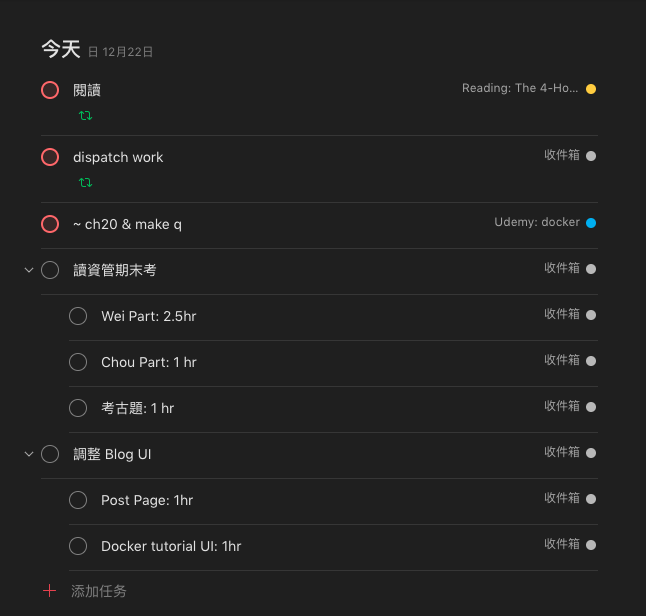

今天，我想和大家分享我平時是怎麼做時間管理的，包括我用了什麼工具，以及哪些我認為很重要的思維。

首先來談談思維

## 思維

### 1. 為所有事排定優先順序

一天裡所有事的重要程度都不一樣，但如果你沒有刻意去排他們的優先次序，會很容易將他們視為同等重要來處理，這會導致你忙了一天，真正重要的事卻沒完成，關於優先順序的重要性，可以看看這一部 [TEDxTalks](https://www.youtube.com/watch?v=REMIND0mOmQ) 。

判斷一個人時間管理的好壞，可以用兩個指標來衡量：一個是「Effectiveness」，另一個是「Efficiency」，其中「Effectiveness」代表你做的事是否有讓你更接近目標，如果你時常將時間拿來做不是最重要的事，那麼你在「Effectiveness」這一項就會表現不好，走的很快卻走錯了方向，因此在規劃一天的行程時，務必思考每件事的重要程度。

### 2. 80/20 法則

80 / 20 法則指的是 80% 的成果往往是由 20% 甚至更少的原因造成的，這個道理可以應用在很多地方，像是一個著名的例子：世界上 80% 的財富集中在 20% 或甚至更少的人身上，同樣的，你可以應用這個法則到時間管理上，對於工作，20% 的工作內容往往會決定 80% 的工作成效，因此在做任何一件事前，不要馬上動手，先試著找出那決定性的 20%，專注把那 20% 做好就好，這樣子能省下很多時間。

### 3. Parkinson’s Law

Parkinson’s Law 是我們常常面臨的一個很有趣的現象，不知道你有沒有在 deadline 前趕作業的經驗，那時可能距離繳交期限只剩 1 天或 1, 2 個小時，看似根本不可能來得及，但不知怎麼搞的，你最後卻出乎意料地在期限內趕完，這個過程就是 Parkinson’s Law 的一個例子。

Parkinson’s Law 說我們傾向於「讓工作塞滿我們給定他的時間」，例如你為一項小作業設定了一整天的時間來做，那你極有可能真的會花一整天來做那項作業，可能因為拖延，也可能因為你不斷催毛求疵，提升作業的複雜度讓他變得需要很多時間來完成。相反的，如果你排了極少時間給一個大作業上， 你會傾向於減少他的複雜度，用最少的工作來達到最大的效果，同時也會更有效率的完成。

想藉助 Parkinson’s Law 的幫忙，你必須為你的每樣任務設一個期限，告訴自己一定得在那個期限內完成它。

## 工具與使用方法

我最常用也最愛用的工具是 Google Calendar 和 Todoist，底下來分別介紹我是怎麼用的：

### Google Calendar

關於 Google Calendar 我的用法其實很簡單，我會把固定的行程都排在上面，像是：幾點到幾點和某人吃飯、開會時間等等，但不會記待辦事項，關於代辦事項我會以 Todoist 來管理。

### Todoist

這是我一個星期日的行程

首先我會視覺化每件事的重要程度，像在這「閱讀」、「dispatch work」、「~ch20 & make q」就是我覺得今天一定要完成的事，完成這些事會讓我距離我設定的目標更近一些，通常我會利用我最有精力的時段（早上）來完成這些事。

再來，我會針對不熟悉的事更進一步地列出要完成的子項目，這些子項目是我認為可以達到 80% 工作效果的 20% 工作內容，同時我也會估一個可能的完成時間，利用 Parkinson’s Law 提升效率，並專注在真正重要的部分上。對於那些熟悉的事，像「閱讀」、「dispatch work」… 因為已經很有經驗，所以不用特別列出子項目並估時間。

而我選 Todoist 的原因是他能語意化的建立目標，像我可以在新任務名稱處打上「每天閱讀」，Todoist 就會判斷這是一個每天循環的任務，而任務名稱叫做「閱讀」，這讓我的操作變的十分順暢，同時它的介面設計也很棒，讓我每天打開 app 都很愉悅。

以上就是我做時間管理的方法，希望能給予你們一些啟發 😉
